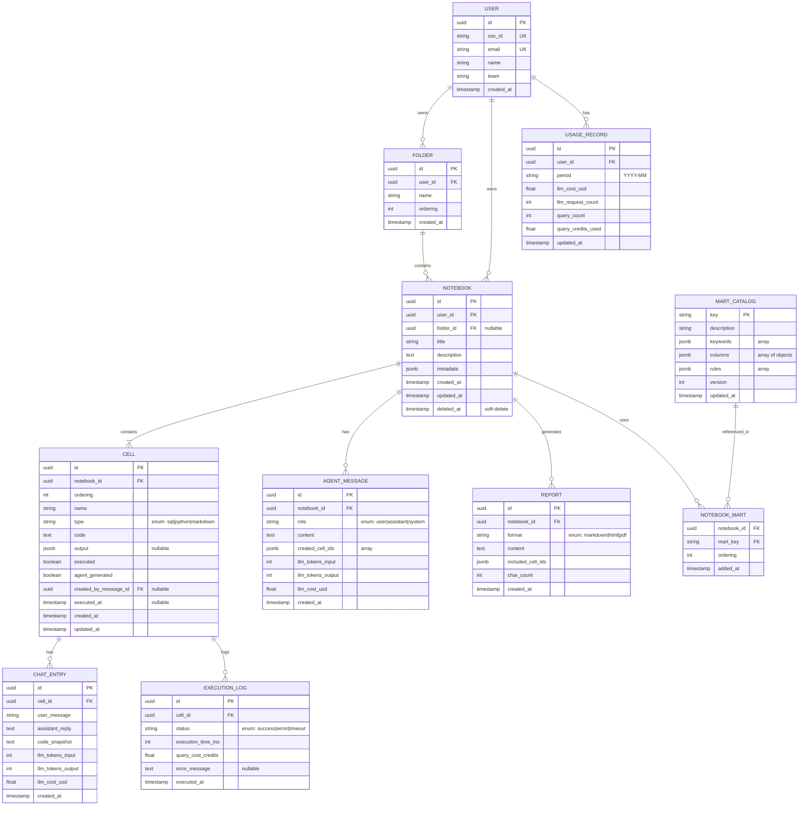

# Vibe EDA — 데이터 모델 & ERD

**버전**: v1.0 (aspirational / 멀티유저 확장용)
**DB**: PostgreSQL 15+
**작성일**: 2026-04-18 / **최신화**: 2026-04-20

> ⚠️ **구현 상태 주의**: 현재 MVP는 **PostgreSQL을 사용하지 않음**. 모든 데이터는 `~/vibe-notebooks/` 하위의 `.ipynb` 파일과 `.vibe_config.json`에 저장된다. 아래 ERD는 향후 멀티유저/클라우드 배포 시 참고용 설계다. SQLAlchemy 모델 뼈대는 `backend/app/models.py`에 선언만 되어 있고 초기화되지 않는다.
>
> 현재 실제 저장 구조는 `CLAUDE.md`의 ".ipynb 파일 구조" 섹션과 `backend/app/services/notebook_store.py` 를 참고.

---

## 1. ERD 개요 (Mermaid)



---

## 2. 테이블 정의

### 2.1 `users` — 사용자

```sql
CREATE TABLE users (
    id              UUID PRIMARY KEY DEFAULT gen_random_uuid(),
    sso_id          VARCHAR(255) UNIQUE NOT NULL,
    email           VARCHAR(255) UNIQUE NOT NULL,
    name            VARCHAR(100) NOT NULL,
    team            VARCHAR(100),
    created_at      TIMESTAMPTZ NOT NULL DEFAULT NOW(),
    last_login_at   TIMESTAMPTZ
);

CREATE INDEX idx_users_email ON users(email);
CREATE INDEX idx_users_sso_id ON users(sso_id);
```

**주의사항**
- `sso_id`: Okta/SAML IdP의 고유 ID
- PII(이름/이메일) 접근은 감사 로그에 기록

---

### 2.2 `folders` — 히스토리 정리 폴더

```sql
CREATE TABLE folders (
    id              UUID PRIMARY KEY DEFAULT gen_random_uuid(),
    user_id         UUID NOT NULL REFERENCES users(id) ON DELETE CASCADE,
    name            VARCHAR(100) NOT NULL,
    ordering        INTEGER NOT NULL DEFAULT 0,
    created_at      TIMESTAMPTZ NOT NULL DEFAULT NOW()
);

CREATE INDEX idx_folders_user ON folders(user_id, ordering);
```

**제약**
- 동일 사용자 내 동일 이름 폴더 **허용** (MVP, UX 혼란 최소 의도)
- v1.1에서 `UNIQUE (user_id, name)` 고려

---

### 2.3 `notebooks` — 분석 노트북 (히스토리)

```sql
CREATE TABLE notebooks (
    id              UUID PRIMARY KEY DEFAULT gen_random_uuid(),
    user_id         UUID NOT NULL REFERENCES users(id) ON DELETE CASCADE,
    folder_id       UUID REFERENCES folders(id) ON DELETE SET NULL,
    title           VARCHAR(300) NOT NULL,
    description     TEXT,
    metadata        JSONB NOT NULL DEFAULT '{}',
    -- metadata 예시:
    -- {
    --   "metaCollapsed": false,
    --   "lastActiveCellId": "cl_abc",
    --   "agentModeActive": false
    -- }
    created_at      TIMESTAMPTZ NOT NULL DEFAULT NOW(),
    updated_at      TIMESTAMPTZ NOT NULL DEFAULT NOW(),
    deleted_at      TIMESTAMPTZ  -- soft delete (30일 보관 후 hard delete)
);

CREATE INDEX idx_notebooks_user_updated ON notebooks(user_id, updated_at DESC) 
    WHERE deleted_at IS NULL;
CREATE INDEX idx_notebooks_folder ON notebooks(folder_id) 
    WHERE deleted_at IS NULL;
CREATE INDEX idx_notebooks_soft_delete ON notebooks(deleted_at) 
    WHERE deleted_at IS NOT NULL;
```

**트리거**
```sql
CREATE OR REPLACE FUNCTION update_notebook_updated_at()
RETURNS TRIGGER AS $$
BEGIN
    NEW.updated_at = NOW();
    RETURN NEW;
END;
$$ LANGUAGE plpgsql;

CREATE TRIGGER trg_notebook_updated_at
    BEFORE UPDATE ON notebooks
    FOR EACH ROW EXECUTE FUNCTION update_notebook_updated_at();
```

---

### 2.4 `notebook_marts` — 노트북-마트 관계 (M:N)

```sql
CREATE TABLE notebook_marts (
    notebook_id     UUID NOT NULL REFERENCES notebooks(id) ON DELETE CASCADE,
    mart_key        VARCHAR(100) NOT NULL REFERENCES mart_catalog(key),
    ordering        INTEGER NOT NULL DEFAULT 0,
    added_at        TIMESTAMPTZ NOT NULL DEFAULT NOW(),
    PRIMARY KEY (notebook_id, mart_key)
);

CREATE INDEX idx_notebook_marts_mart ON notebook_marts(mart_key);
```

---

### 2.5 `cells` — 노트북 내 셀

```sql
CREATE TYPE cell_type AS ENUM ('sql', 'python', 'markdown');

CREATE TABLE cells (
    id                      UUID PRIMARY KEY DEFAULT gen_random_uuid(),
    notebook_id             UUID NOT NULL REFERENCES notebooks(id) ON DELETE CASCADE,
    ordering                DOUBLE PRECISION NOT NULL,  -- float for easy reordering
    name                    VARCHAR(100) NOT NULL,
    type                    cell_type NOT NULL,
    code                    TEXT NOT NULL DEFAULT '',
    output                  JSONB,
    -- output 구조:
    -- { "type": "table", "data": {...}, "rowCount": 100 }
    -- { "type": "chart", "data": {plotlyJson}, "stdout": "..." }
    -- { "type": "error", "data": {"message": "..."} }
    executed                BOOLEAN NOT NULL DEFAULT false,
    agent_generated         BOOLEAN NOT NULL DEFAULT false,
    created_by_message_id   UUID REFERENCES agent_messages(id) ON DELETE SET NULL,
    executed_at             TIMESTAMPTZ,
    created_at              TIMESTAMPTZ NOT NULL DEFAULT NOW(),
    updated_at              TIMESTAMPTZ NOT NULL DEFAULT NOW()
);

CREATE INDEX idx_cells_notebook_ordering ON cells(notebook_id, ordering);
CREATE INDEX idx_cells_agent_message ON cells(created_by_message_id)
    WHERE created_by_message_id IS NOT NULL;
```

**`ordering` 필드 설계**
- `DOUBLE PRECISION` 사용 → 셀 사이 삽입 시 정수 재할당 불필요
- 예: [1.0, 2.0, 3.0] 사이에 삽입 → 1.5 부여
- 주기적 **리밸런싱 배치 작업** 필요 (정밀도 고갈 방지, 월 1회)

**`output` JSONB 스키마 검증**
```sql
ALTER TABLE cells ADD CONSTRAINT cells_output_schema CHECK (
    output IS NULL OR (
        output ? 'type' AND 
        output->>'type' IN ('table', 'chart', 'markdown', 'error')
    )
);
```

---

### 2.6 `chat_entries` — 셀별 바이브 대화

```sql
CREATE TABLE chat_entries (
    id                  UUID PRIMARY KEY DEFAULT gen_random_uuid(),
    cell_id             UUID NOT NULL REFERENCES cells(id) ON DELETE CASCADE,
    user_message        TEXT NOT NULL,
    assistant_reply     TEXT NOT NULL,
    code_snapshot       TEXT NOT NULL,  -- 롤백용
    llm_tokens_input    INTEGER NOT NULL DEFAULT 0,
    llm_tokens_output   INTEGER NOT NULL DEFAULT 0,
    llm_cost_usd        DECIMAL(10, 6) NOT NULL DEFAULT 0,
    model_name          VARCHAR(50),  -- 예: "claude-opus-4-7"
    created_at          TIMESTAMPTZ NOT NULL DEFAULT NOW()
);

CREATE INDEX idx_chat_entries_cell ON chat_entries(cell_id, created_at);
```

---

### 2.7 `agent_messages` — 에이전트 모드 대화

```sql
CREATE TYPE message_role AS ENUM ('user', 'assistant', 'system');

CREATE TABLE agent_messages (
    id                  UUID PRIMARY KEY DEFAULT gen_random_uuid(),
    notebook_id         UUID NOT NULL REFERENCES notebooks(id) ON DELETE CASCADE,
    role                message_role NOT NULL,
    content             TEXT NOT NULL,
    created_cell_ids    JSONB NOT NULL DEFAULT '[]',  -- UUID 배열
    llm_tokens_input    INTEGER NOT NULL DEFAULT 0,
    llm_tokens_output   INTEGER NOT NULL DEFAULT 0,
    llm_cost_usd        DECIMAL(10, 6) NOT NULL DEFAULT 0,
    model_name          VARCHAR(50),
    created_at          TIMESTAMPTZ NOT NULL DEFAULT NOW()
);

CREATE INDEX idx_agent_messages_notebook ON agent_messages(notebook_id, created_at);
```

---

### 2.8 `execution_logs` — 쿼리/코드 실행 기록

```sql
CREATE TYPE execution_status AS ENUM ('success', 'error', 'timeout', 'cancelled');

CREATE TABLE execution_logs (
    id                      UUID PRIMARY KEY DEFAULT gen_random_uuid(),
    cell_id                 UUID NOT NULL REFERENCES cells(id) ON DELETE CASCADE,
    status                  execution_status NOT NULL,
    execution_time_ms       INTEGER NOT NULL,
    query_cost_credits      DECIMAL(10, 6),  -- Snowflake credits (SQL만)
    row_count               INTEGER,          -- SQL 반환 행 수
    error_message           TEXT,
    error_details           JSONB,
    executed_at             TIMESTAMPTZ NOT NULL DEFAULT NOW()
);

CREATE INDEX idx_execution_logs_cell ON execution_logs(cell_id, executed_at DESC);
CREATE INDEX idx_execution_logs_errors ON execution_logs(status, executed_at) 
    WHERE status = 'error';
```

**용도**
- 실행 히스토리 조회
- 비용/성능 모니터링
- 장애 분석

---

### 2.9 `reports` — 생성된 리포트

```sql
CREATE TYPE report_format AS ENUM ('markdown', 'html', 'pdf');

CREATE TABLE reports (
    id                  UUID PRIMARY KEY DEFAULT gen_random_uuid(),
    notebook_id         UUID NOT NULL REFERENCES notebooks(id) ON DELETE CASCADE,
    format              report_format NOT NULL DEFAULT 'markdown',
    content             TEXT NOT NULL,
    included_cell_ids   JSONB NOT NULL,  -- 포함된 셀 UUID 배열
    char_count          INTEGER NOT NULL,
    created_at          TIMESTAMPTZ NOT NULL DEFAULT NOW()
);

CREATE INDEX idx_reports_notebook ON reports(notebook_id, created_at DESC);
```

---

### 2.10 `mart_catalog` — 마트 메타데이터

```sql
CREATE TABLE mart_catalog (
    key             VARCHAR(100) PRIMARY KEY,
    description     VARCHAR(500) NOT NULL,
    keywords        JSONB NOT NULL DEFAULT '[]',
    columns         JSONB NOT NULL DEFAULT '[]',
    -- columns 구조:
    -- [
    --   { "name": "sale_date", "type": "DATE", "desc": "판매일자", "nullable": false },
    --   ...
    -- ]
    rules           JSONB NOT NULL DEFAULT '[]',
    -- rules: 자연어 비즈니스 규칙 배열
    -- ["지역별 판매 상한선 존재", ...]
    snowflake_schema VARCHAR(100),
    snowflake_table  VARCHAR(100),
    version         INTEGER NOT NULL DEFAULT 1,
    is_active       BOOLEAN NOT NULL DEFAULT true,
    updated_at      TIMESTAMPTZ NOT NULL DEFAULT NOW(),
    created_at      TIMESTAMPTZ NOT NULL DEFAULT NOW()
);

CREATE INDEX idx_mart_catalog_active ON mart_catalog(is_active);

-- 전문 검색 인덱스 (한글 지원)
CREATE INDEX idx_mart_catalog_search ON mart_catalog 
    USING GIN (to_tsvector('simple', key || ' ' || description));
```

**마트 버저닝**
- `version` 증가 시 별도 이력 테이블 `mart_catalog_history`에 이전 버전 저장
- 노트북은 `mart_snapshot`을 자체 저장하여 과거 버전 재현 가능 (v1.1)

---

### 2.11 `usage_records` — 사용량/비용 집계

```sql
CREATE TABLE usage_records (
    id                      UUID PRIMARY KEY DEFAULT gen_random_uuid(),
    user_id                 UUID NOT NULL REFERENCES users(id) ON DELETE CASCADE,
    period                  CHAR(7) NOT NULL,  -- 'YYYY-MM'
    llm_cost_usd            DECIMAL(10, 4) NOT NULL DEFAULT 0,
    llm_request_count       INTEGER NOT NULL DEFAULT 0,
    query_count             INTEGER NOT NULL DEFAULT 0,
    query_credits_used      DECIMAL(10, 4) NOT NULL DEFAULT 0,
    updated_at              TIMESTAMPTZ NOT NULL DEFAULT NOW(),
    UNIQUE (user_id, period)
);

CREATE INDEX idx_usage_records_user_period ON usage_records(user_id, period DESC);
```

**업데이트 전략**
- `chat_entries`/`agent_messages` 생성 시 트리거 또는 async worker로 집계
- 실시간 조회 → 월말 배치로 확정

---

### 2.12 `audit_logs` — 감사 로그

```sql
CREATE TABLE audit_logs (
    id              UUID PRIMARY KEY DEFAULT gen_random_uuid(),
    user_id         UUID REFERENCES users(id),
    action          VARCHAR(100) NOT NULL,
    -- 예: 'notebook.create', 'notebook.delete', 'llm.request', 
    --     'query.execute', 'report.generate'
    resource_type   VARCHAR(50),    -- 'notebook', 'cell', ...
    resource_id     UUID,
    metadata        JSONB,
    ip_address      INET,
    user_agent      TEXT,
    created_at      TIMESTAMPTZ NOT NULL DEFAULT NOW()
);

CREATE INDEX idx_audit_user ON audit_logs(user_id, created_at DESC);
CREATE INDEX idx_audit_action ON audit_logs(action, created_at DESC);

-- 파티셔닝 (월 단위) 고려 (대용량 대응)
-- CREATE TABLE audit_logs_2026_04 PARTITION OF audit_logs
--     FOR VALUES FROM ('2026-04-01') TO ('2026-05-01');
```

---

## 3. 마이그레이션 전략

### 3.1 도구
- **Alembic** (Python FastAPI 백엔드 시) 또는 **Flyway** (언어 독립)
- 각 변경은 **순차 번호 + 설명** (`V001__create_users.sql`)

### 3.2 원칙
1. **Backward-compatible first**: 컬럼 추가 → 애플리케이션 배포 → 컬럼 제거 (2단계)
2. **Zero-downtime**: 대용량 테이블 변경은 `pt-online-schema-change` 유사 기법
3. **롤백 스크립트** 필수: 각 마이그레이션마다 `up/down`

### 3.3 주요 마이그레이션 순서
```
V001__create_users.sql
V002__create_folders.sql
V003__create_mart_catalog.sql
V004__create_notebooks.sql
V005__create_notebook_marts.sql
V006__create_cells.sql
V007__create_chat_entries.sql
V008__create_agent_messages.sql
V009__create_execution_logs.sql
V010__create_reports.sql
V011__create_usage_records.sql
V012__create_audit_logs.sql
V013__seed_mart_catalog.sql  -- 초기 마트 6종 시드
```

---

## 4. 시드 데이터 (Mart Catalog)

```sql
INSERT INTO mart_catalog (key, description, keywords, columns, rules, snowflake_schema, snowflake_table)
VALUES
('ad_sales_mart', '일별 광고 판매 집계 마트',
  '["매출", "판매", "광고", "지역", "시도", "시군구", "ctr", "노출", "클릭"]'::jsonb,
  '[
    {"name": "sale_date", "type": "DATE", "desc": "판매일자"},
    {"name": "sido", "type": "VARCHAR", "desc": "시도"},
    {"name": "sigungu", "type": "VARCHAR", "desc": "시군구"},
    {"name": "land_name", "type": "VARCHAR", "desc": "판매처/지면명"},
    {"name": "product_id", "type": "VARCHAR", "desc": "광고 상품 ID"},
    {"name": "sales_amount", "type": "NUMBER", "desc": "매출액(원)"},
    {"name": "impressions", "type": "NUMBER", "desc": "노출수"},
    {"name": "clicks", "type": "NUMBER", "desc": "클릭수"}
  ]'::jsonb,
  '["지역별 판매 상한선 존재", "동일 상품은 전 판매처 동일 단가", "sale_date 기준 파티셔닝"]'::jsonb,
  'ADS_MART', 'SALES_DAILY_AGG'),

('store_info', '판매처 기본 정보 마트',
  '["판매처", "지면", "점포", "가맹", "등급", "계약"]'::jsonb,
  '[
    {"name": "land_name", "type": "VARCHAR", "desc": "판매처명"},
    {"name": "sido", "type": "VARCHAR", "desc": "시도"},
    {"name": "store_tier", "type": "VARCHAR", "desc": "판매처 등급"},
    {"name": "contract_date", "type": "DATE", "desc": "계약일"}
  ]'::jsonb,
  '["판매처는 고유 land_name으로 식별", "등급에 따라 노출 가중치 차등"]'::jsonb,
  'ADS_MART', 'STORE_INFO');

-- ... 나머지 4종도 유사 패턴
```

---

## 5. 쿼리 패턴 예시

### 5.1 노트북 목록 (폴더 포함, 루트만)
```sql
SELECT n.id, n.title, n.updated_at,
       (SELECT COUNT(*) FROM cells c WHERE c.notebook_id = n.id) AS cell_count
FROM notebooks n
WHERE n.user_id = $1
  AND n.folder_id IS NULL
  AND n.deleted_at IS NULL
ORDER BY n.updated_at DESC
LIMIT 20;
```

### 5.2 노트북 전체 로드 (N+1 방지)
```sql
-- 1. 노트북 + 셀 조인
SELECT n.id AS notebook_id, n.title, n.description, n.metadata,
       c.id AS cell_id, c.ordering, c.name, c.type, c.code, c.output, c.executed
FROM notebooks n
LEFT JOIN cells c ON c.notebook_id = n.id
WHERE n.id = $1
ORDER BY c.ordering;

-- 2. 마트 별도 로드
SELECT mart_key FROM notebook_marts WHERE notebook_id = $1;
```

### 5.3 사용자 월간 사용량
```sql
SELECT period, llm_cost_usd, llm_request_count, query_count
FROM usage_records
WHERE user_id = $1
  AND period >= TO_CHAR(NOW() - INTERVAL '6 months', 'YYYY-MM')
ORDER BY period DESC;
```

### 5.4 마트 전문 검색 (한글 지원)
```sql
SELECT key, description,
       similarity(description, $1) AS score
FROM mart_catalog
WHERE is_active = true
  AND (
    key ILIKE '%' || $1 || '%'
    OR description ILIKE '%' || $1 || '%'
    OR EXISTS (
      SELECT 1 FROM jsonb_array_elements_text(keywords) kw
      WHERE kw ILIKE '%' || $1 || '%'
    )
  )
ORDER BY score DESC
LIMIT 10;
```

---

## 6. 성능 고려사항

### 6.1 인덱스 전략
- **복합 인덱스**: `(user_id, updated_at DESC)` — 목록 조회 빈번
- **부분 인덱스**: `WHERE deleted_at IS NULL` — 활성 데이터만
- **GIN 인덱스**: JSONB 필드 검색 (`output`, `keywords`)

### 6.2 파티셔닝
- `audit_logs`: 월 단위 파티셔닝
- `execution_logs`: 분기 단위 파티셔닝 (v1.1)

### 6.3 캐싱 (Redis)
| 키 패턴 | TTL | 내용 |
|---|---|---|
| `user:{id}:session` | 8h | JWT, 권한 |
| `mart:catalog:list` | 1h | 전체 마트 목록 |
| `notebook:{id}:cells` | 5min | 셀 목록 (편집 시 invalidate) |
| `usage:{userId}:{period}` | 5min | 월간 사용량 |
| `llm:response:{hash}` | 24h | 동일 프롬프트 응답 재활용 |

### 6.4 대용량 테이블 예상치 (6개월 기준)
| 테이블 | 예상 행 수 | 크기 |
|---|---|---|
| notebooks | 3,000 | 10 MB |
| cells | 30,000 | 150 MB |
| chat_entries | 150,000 | 500 MB |
| agent_messages | 50,000 | 200 MB |
| execution_logs | 200,000 | 100 MB |
| audit_logs | 1,000,000+ | 500 MB |

---

## 7. 보안 / 데이터 보호

### 7.1 암호화
- **At-rest**: PostgreSQL TDE 또는 디스크 암호화
- **In-transit**: TLS 1.3
- **PII 필드**: `users.email`, `users.name` → 필요 시 컬럼 레벨 암호화 (pgcrypto)

### 7.2 Row-Level Security (RLS)
```sql
ALTER TABLE notebooks ENABLE ROW LEVEL SECURITY;

CREATE POLICY notebooks_user_isolation ON notebooks
    USING (user_id = current_setting('app.user_id')::uuid);
```
애플리케이션에서 요청 시 `SET app.user_id = '...'` 설정.

### 7.3 데이터 보관 정책
| 데이터 | 보관 기간 |
|---|---|
| 활성 노트북/셀 | 무제한 |
| 삭제된 노트북 (soft-delete) | 30일 후 hard delete |
| `audit_logs` | 2년 |
| `execution_logs` | 6개월 |
| `chat_entries` | 노트북과 동일 수명 |

---

## 8. 백업 & DR

### 8.1 백업
- **자동 스냅샷**: 매일 00:00 (RPO 24h)
- **Point-in-Time Recovery**: 7일 이내 (WAL 아카이빙)
- **논리 백업**: 주 1회 `pg_dump` → S3 암호화 저장 (30일 보관)

### 8.2 DR
- **Multi-AZ Failover**: Primary/Standby (RTO 5분)
- **Cross-region Replica**: 재해 대비 (RTO 1h)

---

## 9. 개발 환경 설정

### 9.1 Docker Compose (로컬)
```yaml
services:
  postgres:
    image: postgres:15-alpine
    environment:
      POSTGRES_USER: vibe_eda
      POSTGRES_PASSWORD: dev_password
      POSTGRES_DB: vibe_eda_dev
    ports:
      - "5432:5432"
    volumes:
      - pg_data:/var/lib/postgresql/data
      - ./migrations:/docker-entrypoint-initdb.d
  
  redis:
    image: redis:7-alpine
    ports:
      - "6379:6379"

volumes:
  pg_data:
```

### 9.2 시드 스크립트
- `scripts/seed_dev.py` — 테스트 사용자 + 샘플 노트북 3개 + 마트 카탈로그

---

## 10. 체크리스트

개발 시작 전:
- [ ] 초기 마이그레이션 실행 (V001~V013)
- [ ] 마트 카탈로그 시드 확인
- [ ] 개발자 테스트 계정 생성
- [ ] `ordering` 리밸런싱 배치 작업 스케줄링
- [ ] `usage_records` 집계 cron 설정
- [ ] 감사 로그 파티셔닝 적용

운영 준비 전:
- [ ] RLS 정책 모든 사용자 테이블에 적용
- [ ] 백업/PITR 테스트 (복구 성공 확인)
- [ ] 인덱스 사용률 모니터링 (`pg_stat_user_indexes`)
- [ ] Slow query log 활성화 (>1s)

---

*Related: api-spec.md, prd.md, llm-prompt-guide.md*
*Last updated: 2026-04-18*
